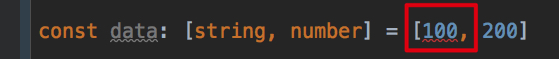
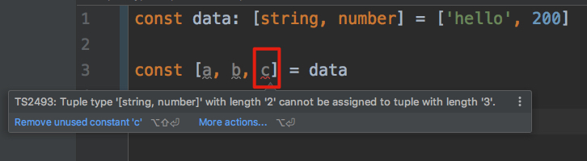

TypeScript Tuple Demo
=====================

Typescript have tuple type and can check the types of values.

Invalid type of value:



Wrong number of values:



Run
---

```
npm install
npx ts-node hello.ts
```

It prints

```
hello
200
```
